This is the supplementary Mathematica notebook for "**Thermodynamics of ideal spin fluids and pseudo-gauge ambiguity**"

## Useful definitions

```wl
In[]:= $Assumptions = {T0 > 0};
```

```wl
In[]:= nullFunc[vT_, v\[Nu]_, v\[Alpha]2_, vw2_, v\[Alpha]w_] = 0;
```

```wl
In[]:= ZeroFunc[T_, A_] := 0
```

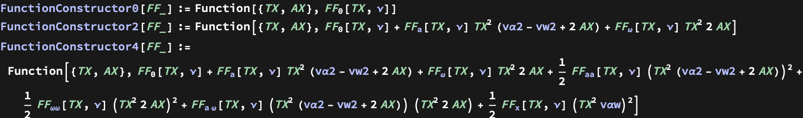

```wl
In[]:= ScaleVars = {v\[Alpha]2 -> \[ScriptE]^2 v\[Alpha]2, vw2 -> \[ScriptE]^2 vw2, v\[Alpha]w -> \[ScriptE]^2 v\[Alpha]w};
```

## Pseudo-gauge transformation results

In this section we collect the results of pseudo-gauge transformations of the currents. 

### Belinfante tensor (even levels)

```wl
In[]:= nontrivialCoeffsEven = {1, 2, 7, 8, 9, 13, 15, 16, 25, 27, 29, 31};
```

##### Term 1

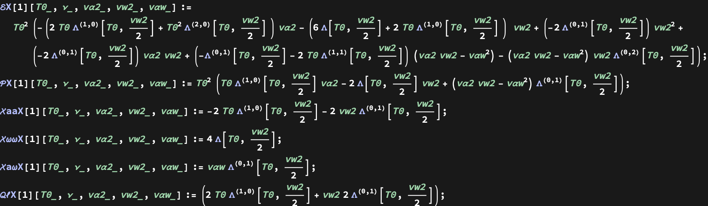

##### Term 2

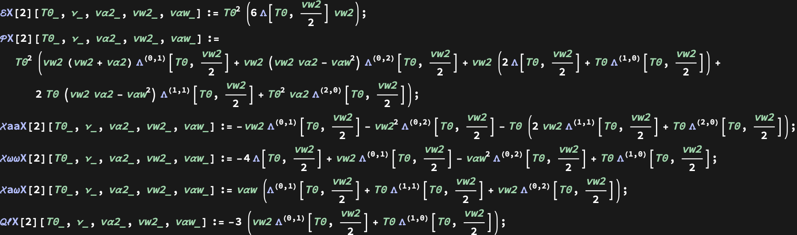

##### Term 7

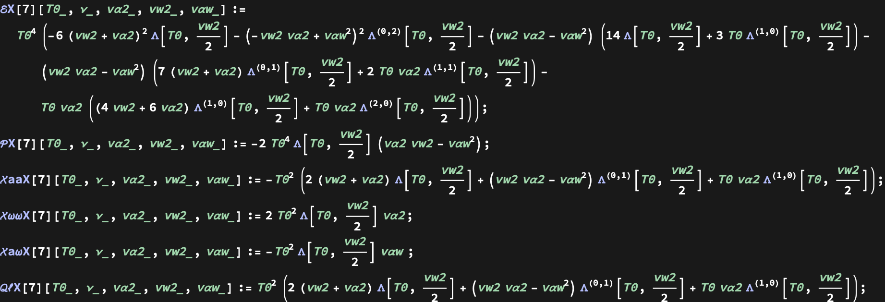

##### Term 8

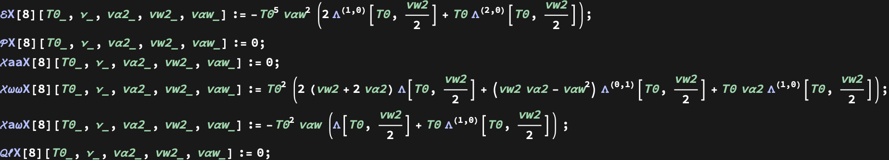

##### Term 9

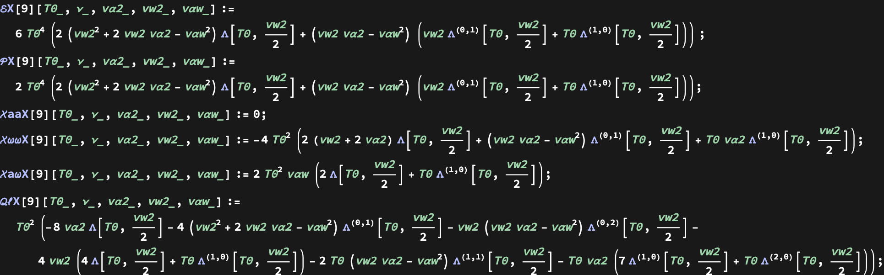

##### Term 13

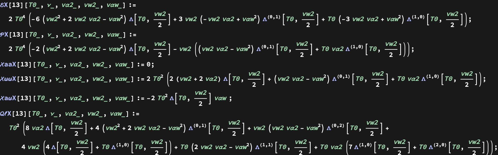

##### Term 15

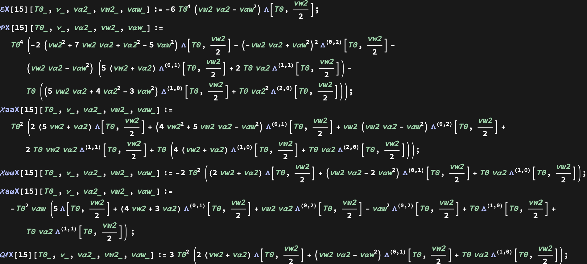

##### Term 16

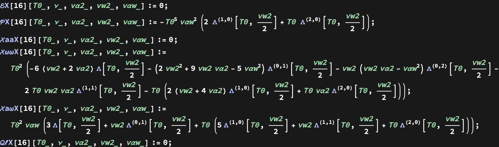

##### Term 25

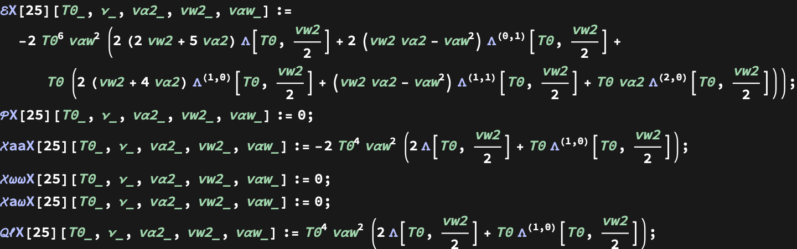

##### Term 27

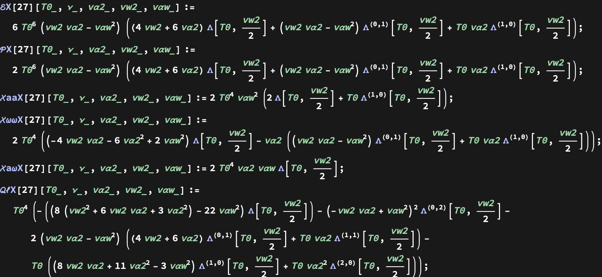

##### Term 29

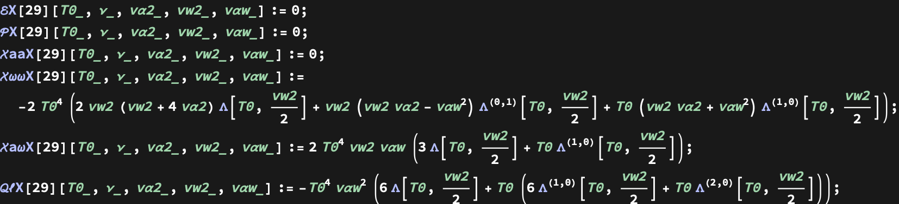

##### Term 31

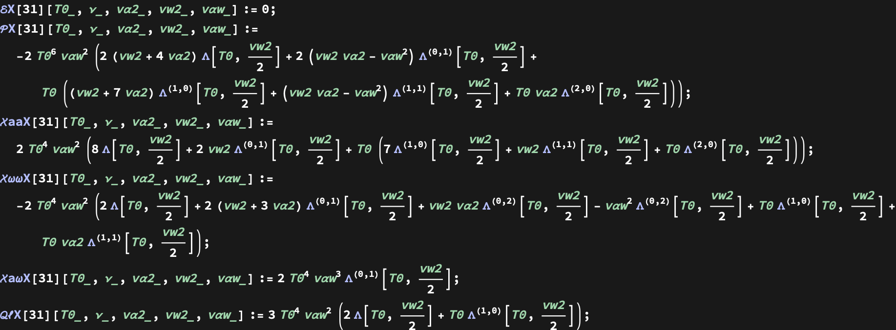

##### Final

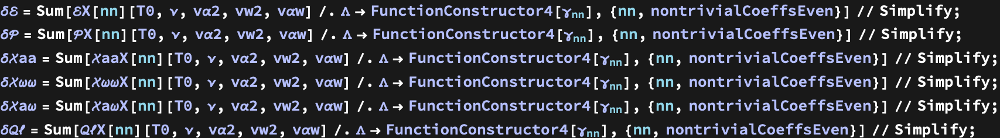

### Belinfante tensor (odd levels)

```wl
In[]:= nontrivialCoeffsOdd = {4, 17, 19, 21, 23, 33, 34, 36};
```

##### Term 4

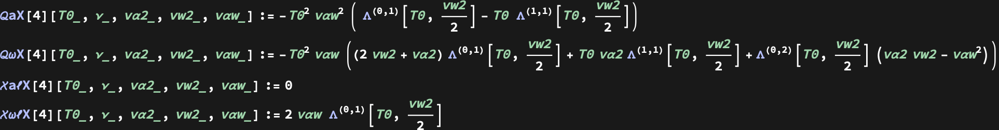

##### Term 17

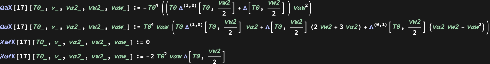

##### Term 19

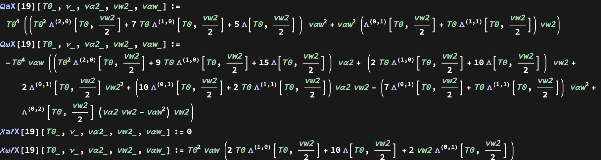

##### Term 21

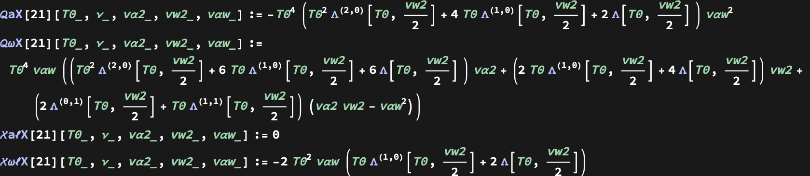

```wl
In[]:= \[Omega]\[Mu] + O[\[ScriptE]]^2
```

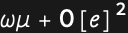

##### Term 23

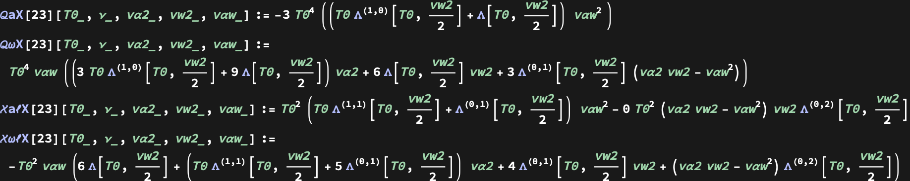

##### Term 33

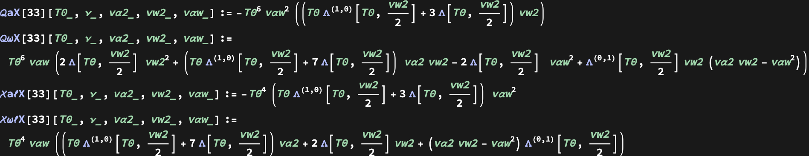

##### Term 34

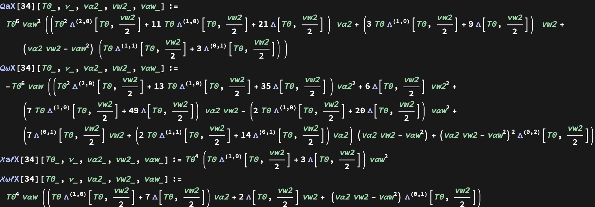

##### Term 36

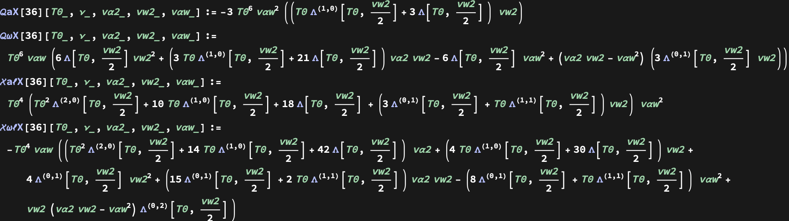

##### Final

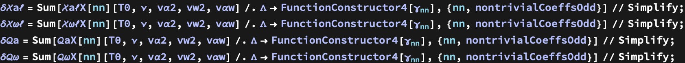

### Charge current (odd levels)

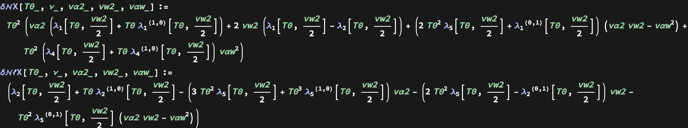

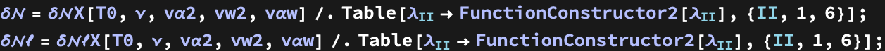

### Charge current (even levels)

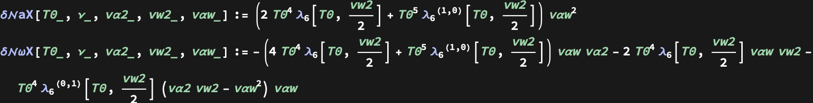

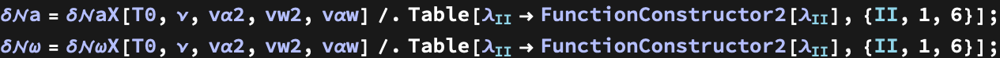

## Pseudo-gauge transformation derivation (DO NOT COMPILE unless needed)

In this section we present the derivation/verification of pseudo-gauge transformations of the currents. 
You can skip this section and move directly to later ones for efficiency.

### Preparation

```wl
In[]:= ExpansionStrength = 9;
```

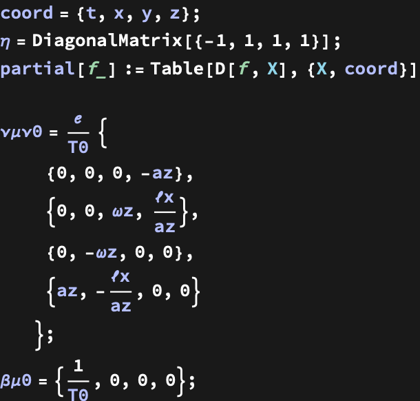

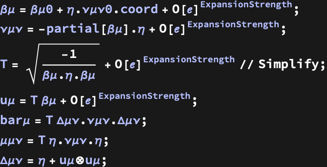


```wl
In[]:= a2 = a\[Mu] . \[Eta] . a\[Mu];
 \[Omega]2 = \[Omega]\[Mu] . \[Eta] . \[Omega]\[Mu];
 a\[Omega] = a\[Mu] . \[Eta] . \[Omega]\[Mu];
```

```wl
In[]:= vars = {T0, \[Nu], \[Alpha]2, w2, \[Alpha]w};
 VARS = {T, \[Nu], a2/T^2, \[Omega]2/T^2, a\[Omega]/T^2};
```

```wl
In[]:= T\[Mu]\[Nu]ConstructorEven[\[ScriptCapitalE]_, \[ScriptCapitalP]_, \[ScriptCapitalX]aa_, \[ScriptCapitalX]\[Omega]\[Omega]_, \[ScriptCapitalX]a\[Omega]_, \[ScriptCapitalQ]\[ScriptL]_] := (\[ScriptCapitalE] @@ VARS) u\[Mu]\[TensorProduct]u\[Mu] + (\[ScriptCapitalP] @@ VARS) \[CapitalDelta]\[Mu]\[Nu] + (\[ScriptCapitalX]aa @@ VARS) a\[Mu]\[TensorProduct]a\[Mu] + (\[ScriptCapitalX]\[Omega]\[Omega] @@ VARS) \[Omega]\[Mu]\[TensorProduct]\[Omega]\[Mu] + (\[ScriptCapitalX]a\[Omega] @@ VARS ) (\[Omega]\[Mu]\[TensorProduct]a\[Mu] + a\[Mu]\[TensorProduct]\[Omega]\[Mu]) + (\[ScriptCapitalQ]\[ScriptL] @@ VARS) (\[ScriptL]\[Mu]\[TensorProduct]u\[Mu] + u\[Mu]\[TensorProduct]\[ScriptL]\[Mu]);
 T\[Mu]\[Nu]ConstructorOdd[\[ScriptCapitalQ]a_, \[ScriptCapitalQ]\[Omega]_, \[ScriptCapitalX]a\[ScriptL]_, \[ScriptCapitalX]\[Omega]\[ScriptL]_] := (\[ScriptCapitalQ]a @@ VARS) (u\[Mu]\[TensorProduct]a\[Mu] + a\[Mu]\[TensorProduct]u\[Mu]) + (\[ScriptCapitalQ]\[Omega] @@ VARS) (u\[Mu]\[TensorProduct]\[Omega]\[Mu] + \[Omega]\[Mu]\[TensorProduct]u\[Mu]) + (\[ScriptCapitalX]a\[ScriptL] @@ VARS) (\[ScriptL]\[Mu]\[TensorProduct]a\[Mu] + a\[Mu]\[TensorProduct]\[ScriptL]\[Mu]) + (\[ScriptCapitalX]\[Omega]\[ScriptL] @@ VARS) (\[ScriptL]\[Mu]\[TensorProduct]\[Omega]\[Mu] + \[Omega]\[Mu]\[TensorProduct]\[ScriptL]\[Mu])
 J\[Mu]Constructor[\[ScriptCapitalN]_, \[ScriptCapitalJ]a_, \[ScriptCapitalJ]\[Omega]_, \[ScriptCapitalJ]\[ScriptL]_] := (\[ScriptCapitalN] @@ VARS) u\[Mu] + (\[ScriptCapitalJ]a @@ VARS) a\[Mu] + (\[ScriptCapitalJ]\[Omega] @@ VARS) \[Omega]\[Mu] + (\[ScriptCapitalJ]\[ScriptL] @@ VARS) \[ScriptL]\[Mu];
```

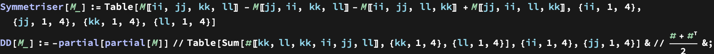

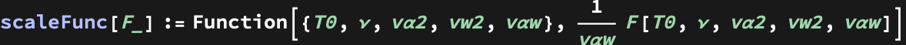

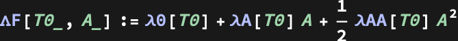

### Charge current

```wl
In[]:= fJ[1] = u\[Mu]\[TensorProduct]a\[Mu] - a\[Mu]\[TensorProduct]u\[Mu];
 fJ[2] = bar\[Mu];
 fJ[3] = u\[Mu]\[TensorProduct]\[ScriptL]\[Mu] - \[ScriptL]\[Mu]\[TensorProduct]u\[Mu];
 fJ[4] = a\[Omega] (u\[Mu]\[TensorProduct]\[Omega]\[Mu] - \[Omega]\[Mu]\[TensorProduct]u\[Mu]);
 fJ[5] = a\[Mu]\[TensorProduct]\[ScriptL]\[Mu] - \[ScriptL]\[Mu]\[TensorProduct]a\[Mu];
 fJ[6] = a\[Omega] (a\[Mu]\[TensorProduct]\[Omega]\[Mu] - \[Omega]\[Mu]\[TensorProduct]a\[Mu]);
```

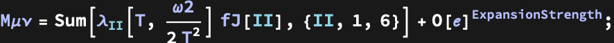

```wl
In[]:= J\[Mu]CorrectionAnsatz = M\[Mu]\[Nu] // partial[#] & // Tr[#, Plus, 2] &;
```

```wl
In[]:= \[Delta]J\[Mu]X = J\[Mu]Constructor[\[Delta]\[ScriptCapitalN]X, \[Delta]\[ScriptCapitalJ]aX, \[Delta]\[ScriptCapitalJ]\[Omega]X, \[Delta]\[ScriptCapitalJ]\[ScriptL]X];
 J\[Mu]CorrectionAnsatz - \[Delta]J\[Mu]X + O[\[ScriptE]]^9 // Simplify
```

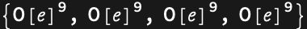

### Belinfante tensor -- independent structures

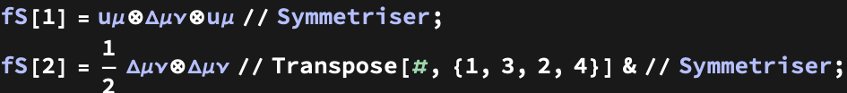

```wl
In[]:= fS[3] = u\[Mu]\[TensorProduct]bar\[Mu]\[TensorProduct]u\[Mu] // Symmetriser;
 fS[4] = (u\[Mu]\[TensorProduct]\[CapitalDelta]\[Mu]\[Nu]\[TensorProduct]a\[Mu] + a\[Mu]\[TensorProduct]\[CapitalDelta]\[Mu]\[Nu]\[TensorProduct]u\[Mu]) // Symmetriser;
 fS[5] = (u\[Mu]\[TensorProduct]\[CapitalDelta]\[Mu]\[Nu]\[TensorProduct]a\[Mu] - a\[Mu]\[TensorProduct]\[CapitalDelta]\[Mu]\[Nu]\[TensorProduct]u\[Mu]) // Symmetriser;
 fS[6] = \[CapitalDelta]\[Mu]\[Nu]\[TensorProduct]bar\[Mu] // Transpose[#, {1, 3, 2, 4}] & // Symmetriser;
```

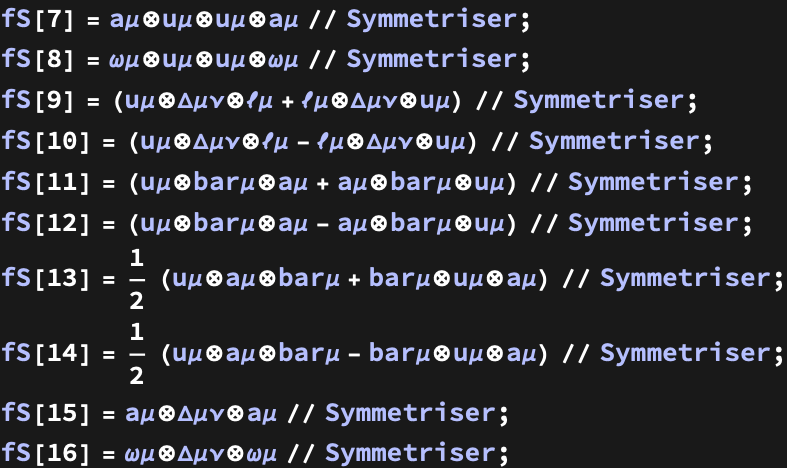

```wl
In[]:= fS[17] = (u\[Mu]\[TensorProduct]a\[Mu]\[TensorProduct]\[ScriptL]\[Mu]\[TensorProduct]u\[Mu] + u\[Mu]\[TensorProduct]\[ScriptL]\[Mu]\[TensorProduct]a\[Mu]\[TensorProduct]u\[Mu]) // Symmetriser;
 fS[18] = (u\[Mu]\[TensorProduct]a\[Mu]\[TensorProduct]\[ScriptL]\[Mu]\[TensorProduct]u\[Mu] - u\[Mu]\[TensorProduct]\[ScriptL]\[Mu]\[TensorProduct]a\[Mu]\[TensorProduct]u\[Mu]) // Symmetriser;
 fS[19] = a\[Omega] (u\[Mu]\[TensorProduct]\[CapitalDelta]\[Mu]\[Nu]\[TensorProduct]\[Omega]\[Mu] + \[Omega]\[Mu]\[TensorProduct]\[CapitalDelta]\[Mu]\[Nu]\[TensorProduct]u\[Mu]) // Symmetriser;
 fS[20] = a\[Omega] (u\[Mu]\[TensorProduct]\[CapitalDelta]\[Mu]\[Nu]\[TensorProduct]\[Omega]\[Mu] - \[Omega]\[Mu]\[TensorProduct]\[CapitalDelta]\[Mu]\[Nu]\[TensorProduct]u\[Mu]) // Symmetriser;
 fS[21] = (u\[Mu]\[TensorProduct]\[Omega]\[Mu]\[TensorProduct]\[Omega]\[Mu]\[TensorProduct]a\[Mu] + a\[Mu]\[TensorProduct]\[Omega]\[Mu]\[TensorProduct]\[Omega]\[Mu]\[TensorProduct]u\[Mu]) // Symmetriser;
 fS[22] = (u\[Mu]\[TensorProduct]\[Omega]\[Mu]\[TensorProduct]\[Omega]\[Mu]\[TensorProduct]a\[Mu] - a\[Mu]\[TensorProduct]\[Omega]\[Mu]\[TensorProduct]\[Omega]\[Mu]\[TensorProduct]u\[Mu]) // Symmetriser;
 fS[23] = (\[ScriptL]\[Mu]\[TensorProduct]\[CapitalDelta]\[Mu]\[Nu]\[TensorProduct]a\[Mu] + a\[Mu]\[TensorProduct]\[CapitalDelta]\[Mu]\[Nu]\[TensorProduct]\[ScriptL]\[Mu]) // Symmetriser;
 fS[24] = (\[ScriptL]\[Mu]\[TensorProduct]\[CapitalDelta]\[Mu]\[Nu]\[TensorProduct]a\[Mu] - a\[Mu]\[TensorProduct]\[CapitalDelta]\[Mu]\[Nu]\[TensorProduct]\[ScriptL]\[Mu]) // Symmetriser;
```

```wl
In[]:= fS[25] = a\[Omega] (u\[Mu]\[TensorProduct]a\[Mu]\[TensorProduct]\[Omega]\[Mu]\[TensorProduct]u\[Mu] + u\[Mu]\[TensorProduct]\[Omega]\[Mu]\[TensorProduct]a\[Mu]\[TensorProduct]u\[Mu]) // Symmetriser;
 fS[26] = a\[Omega] (u\[Mu]\[TensorProduct]a\[Mu]\[TensorProduct]\[Omega]\[Mu]\[TensorProduct]u\[Mu] - u\[Mu]\[TensorProduct]\[Omega]\[Mu]\[TensorProduct]a\[Mu]\[TensorProduct]u\[Mu]) // Symmetriser;
 fS[27] = (u\[Mu]\[TensorProduct]a\[Mu]\[TensorProduct]a\[Mu]\[TensorProduct]\[ScriptL]\[Mu] + \[ScriptL]\[Mu]\[TensorProduct]a\[Mu]\[TensorProduct]a\[Mu]\[TensorProduct]u\[Mu]) // Symmetriser;
 fS[28] = (u\[Mu]\[TensorProduct]a\[Mu]\[TensorProduct]a\[Mu]\[TensorProduct]\[ScriptL]\[Mu] - \[ScriptL]\[Mu]\[TensorProduct]a\[Mu]\[TensorProduct]a\[Mu]\[TensorProduct]u\[Mu]) // Symmetriser;
 fS[29] = (u\[Mu]\[TensorProduct]\[Omega]\[Mu]\[TensorProduct]\[Omega]\[Mu]\[TensorProduct]\[ScriptL]\[Mu] + \[ScriptL]\[Mu]\[TensorProduct]\[Omega]\[Mu]\[TensorProduct]\[Omega]\[Mu]\[TensorProduct]u\[Mu]) // Symmetriser;
 fS[30] = (u\[Mu]\[TensorProduct]\[Omega]\[Mu]\[TensorProduct]\[Omega]\[Mu]\[TensorProduct]\[ScriptL]\[Mu] - \[ScriptL]\[Mu]\[TensorProduct]\[Omega]\[Mu]\[TensorProduct]\[Omega]\[Mu]\[TensorProduct]u\[Mu]) // Symmetriser;
 fS[31] = a\[Omega] (a\[Mu]\[TensorProduct]\[CapitalDelta]\[Mu]\[Nu]\[TensorProduct]\[Omega]\[Mu] + \[Omega]\[Mu]\[TensorProduct]\[CapitalDelta]\[Mu]\[Nu]\[TensorProduct]a\[Mu]) // Symmetriser;
 fS[32] = a\[Omega] (a\[Mu]\[TensorProduct]\[CapitalDelta]\[Mu]\[Nu]\[TensorProduct]\[Omega]\[Mu] - \[Omega]\[Mu]\[TensorProduct]\[CapitalDelta]\[Mu]\[Nu]\[TensorProduct]a\[Mu]) // Symmetriser;
```

```wl
In[]:= fS[33] = a\[Omega] (u\[Mu]\[TensorProduct]\[Omega]\[Mu]\[TensorProduct]\[ScriptL]\[Mu]\[TensorProduct]u\[Mu] + u\[Mu]\[TensorProduct]\[ScriptL]\[Mu]\[TensorProduct]\[Omega]\[Mu]\[TensorProduct]u\[Mu]) // Symmetriser;
 fS[34] = a\[Omega] (u\[Mu]\[TensorProduct]a\[Mu]\[TensorProduct]a\[Mu]\[TensorProduct]\[Omega]\[Mu] + \[Omega]\[Mu]\[TensorProduct]a\[Mu]\[TensorProduct]a\[Mu]\[TensorProduct]u\[Mu]) // Symmetriser;
 fS[35] = a\[Omega] (u\[Mu]\[TensorProduct]a\[Mu]\[TensorProduct]a\[Mu]\[TensorProduct]\[Omega]\[Mu] - \[Omega]\[Mu]\[TensorProduct]a\[Mu]\[TensorProduct]a\[Mu]\[TensorProduct]u\[Mu]) // Symmetriser;
 fS[36] = a\[Omega] (\[ScriptL]\[Mu]\[TensorProduct]\[CapitalDelta]\[Mu]\[Nu]\[TensorProduct]\[Omega]\[Mu] + \[Omega]\[Mu]\[TensorProduct]\[CapitalDelta]\[Mu]\[Nu]\[TensorProduct]\[ScriptL]\[Mu]) // Symmetriser;
```

### Belinfante tensor (even levels)

##### Term 1

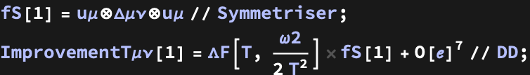

```wl
In[]:= XX = ImprovementT\[Mu]\[Nu][1] - T\[Mu]\[Nu]ConstructorEven[\[ScriptCapitalE]X[1], \[ScriptCapitalP]X[1], \[ScriptCapitalX]aaX[1], \[ScriptCapitalX]\[Omega]\[Omega]X[1], \[ScriptCapitalX]a\[Omega]X[1], \[ScriptCapitalQ]\[ScriptL]X[1]] + O[\[ScriptE]]^7 /. \[CapitalLambda] -> \[CapitalLambda]F // Simplify;
 % // MatrixForm
```

|  |  |  |  |
| - | - | - | - |
| -SeriesData- | -SeriesData- | -SeriesData- | -SeriesData- |
| -SeriesData- | -SeriesData- | -SeriesData- | -SeriesData- |
| -SeriesData- | -SeriesData- | -SeriesData- | -SeriesData- |
| -SeriesData- | -SeriesData- | -SeriesData- | -SeriesData- |

##### Term 2

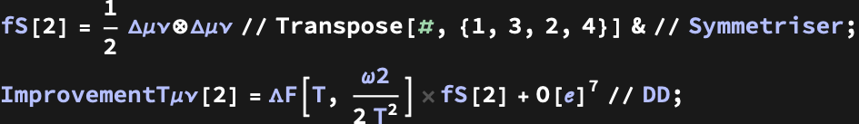

```wl
In[]:= XX = ImprovementT\[Mu]\[Nu][2] - T\[Mu]\[Nu]ConstructorEven[\[ScriptCapitalE]X[2], \[ScriptCapitalP]X[2], \[ScriptCapitalX]aaX[2], \[ScriptCapitalX]\[Omega]\[Omega]X[2], \[ScriptCapitalX]a\[Omega]X[2], \[ScriptCapitalQ]\[ScriptL]X[2]] + O[\[ScriptE]]^7 /. \[CapitalLambda] -> \[CapitalLambda]F // Simplify;
 % // MatrixForm
```

|  |  |  |  |
| - | - | - | - |
| -SeriesData- | -SeriesData- | -SeriesData- | -SeriesData- |
| -SeriesData- | -SeriesData- | -SeriesData- | -SeriesData- |
| -SeriesData- | -SeriesData- | -SeriesData- | -SeriesData- |
| -SeriesData- | -SeriesData- | -SeriesData- | -SeriesData- |

##### Term 7

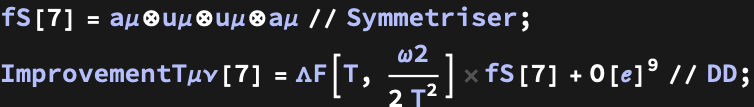

```wl
In[]:= ImprovementT\[Mu]\[Nu][7] - T\[Mu]\[Nu]ConstructorEven[\[ScriptCapitalE]X[7], \[ScriptCapitalP]X[7], \[ScriptCapitalX]aaX[7], \[ScriptCapitalX]\[Omega]\[Omega]X[7], \[ScriptCapitalX]a\[Omega]X[7], \[ScriptCapitalQ]\[ScriptL]X[7]] + O[\[ScriptE]]^9 /. \[CapitalLambda] -> \[CapitalLambda]F // Simplify // MatrixForm
```

|  |  |  |  |
| - | - | - | - |
| -SeriesData- | -SeriesData- | -SeriesData- | -SeriesData- |
| -SeriesData- | -SeriesData- | -SeriesData- | -SeriesData- |
| -SeriesData- | -SeriesData- | -SeriesData- | -SeriesData- |
| -SeriesData- | -SeriesData- | -SeriesData- | -SeriesData- |

##### Term 8

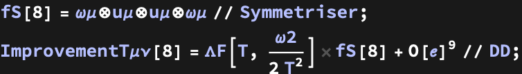

```wl
In[]:= ImprovementT\[Mu]\[Nu][8] - T\[Mu]\[Nu]ConstructorEven[\[ScriptCapitalE]X[8], \[ScriptCapitalP]X[8], \[ScriptCapitalX]aaX[8], \[ScriptCapitalX]\[Omega]\[Omega]X[8], \[ScriptCapitalX]a\[Omega]X[8], \[ScriptCapitalQ]\[ScriptL]X[8]] + O[\[ScriptE]]^9 /. \[CapitalLambda] -> \[CapitalLambda]F // Simplify // MatrixForm
```

|  |  |  |  |
| - | - | - | - |
| -SeriesData- | -SeriesData- | -SeriesData- | -SeriesData- |
| -SeriesData- | -SeriesData- | -SeriesData- | -SeriesData- |
| -SeriesData- | -SeriesData- | -SeriesData- | -SeriesData- |
| -SeriesData- | -SeriesData- | -SeriesData- | -SeriesData- |

##### Term 9

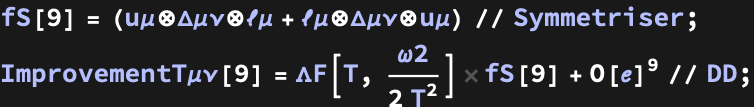

```wl
In[]:= ImprovementT\[Mu]\[Nu][9] - T\[Mu]\[Nu]ConstructorEven[\[ScriptCapitalE]X[9], \[ScriptCapitalP]X[9], \[ScriptCapitalX]aaX[9], \[ScriptCapitalX]\[Omega]\[Omega]X[9], \[ScriptCapitalX]a\[Omega]X[9], \[ScriptCapitalQ]\[ScriptL]X[9]] + O[\[ScriptE]]^9 /. \[CapitalLambda] -> \[CapitalLambda]F // Simplify // MatrixForm
```

|  |  |  |  |
| - | - | - | - |
| -SeriesData- | -SeriesData- | -SeriesData- | -SeriesData- |
| -SeriesData- | -SeriesData- | -SeriesData- | -SeriesData- |
| -SeriesData- | -SeriesData- | -SeriesData- | -SeriesData- |
| -SeriesData- | -SeriesData- | -SeriesData- | -SeriesData- |

##### Term 13

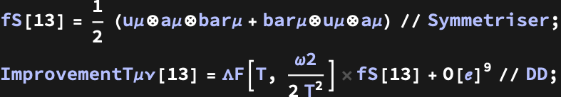

```wl
In[]:= ImprovementT\[Mu]\[Nu][13] - T\[Mu]\[Nu]ConstructorEven[\[ScriptCapitalE]X[13], \[ScriptCapitalP]X[13], \[ScriptCapitalX]aaX[13], \[ScriptCapitalX]\[Omega]\[Omega]X[13], \[ScriptCapitalX]a\[Omega]X[13], \[ScriptCapitalQ]\[ScriptL]X[13]] + O[\[ScriptE]]^9 /. \[CapitalLambda] -> \[CapitalLambda]F // Simplify // MatrixForm
```

|  |  |  |  |
| - | - | - | - |
| -SeriesData- | -SeriesData- | -SeriesData- | -SeriesData- |
| -SeriesData- | -SeriesData- | -SeriesData- | -SeriesData- |
| -SeriesData- | -SeriesData- | -SeriesData- | -SeriesData- |
| -SeriesData- | -SeriesData- | -SeriesData- | -SeriesData- |

##### Term 15


```wl
In[]:= ImprovementT\[Mu]\[Nu][15] - T\[Mu]\[Nu]ConstructorEven[\[ScriptCapitalE]X[15], \[ScriptCapitalP]X[15], \[ScriptCapitalX]aaX[15], \[ScriptCapitalX]\[Omega]\[Omega]X[15], \[ScriptCapitalX]a\[Omega]X[15], \[ScriptCapitalQ]\[ScriptL]X[15]] /. \[CapitalLambda] -> \[CapitalLambda]F // Simplify // MatrixForm
```

|  |  |  |  |
| - | - | - | - |
| -SeriesData- | -SeriesData- | -SeriesData- | -SeriesData- |
| -SeriesData- | -SeriesData- | -SeriesData- | -SeriesData- |
| -SeriesData- | -SeriesData- | -SeriesData- | -SeriesData- |
| -SeriesData- | -SeriesData- | -SeriesData- | -SeriesData- |

##### Term 16

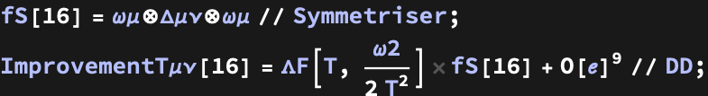

```wl
In[]:= ImprovementT\[Mu]\[Nu][16] - T\[Mu]\[Nu]ConstructorEven[\[ScriptCapitalE]X[16], \[ScriptCapitalP]X[16], \[ScriptCapitalX]aaX[16], \[ScriptCapitalX]\[Omega]\[Omega]X[16], \[ScriptCapitalX]a\[Omega]X[16], \[ScriptCapitalQ]\[ScriptL]X[16]] /. \[CapitalLambda] -> \[CapitalLambda]F // Simplify // MatrixForm
```

|  |  |  |  |
| - | - | - | - |
| -SeriesData- | -SeriesData- | -SeriesData- | -SeriesData- |
| -SeriesData- | -SeriesData- | -SeriesData- | -SeriesData- |
| -SeriesData- | -SeriesData- | -SeriesData- | -SeriesData- |
| -SeriesData- | -SeriesData- | -SeriesData- | -SeriesData- |

##### Term 25 (Scaled)

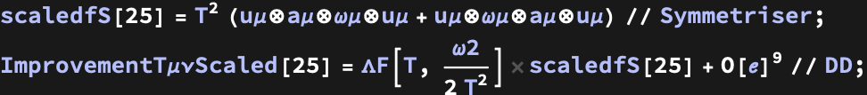

```wl
In[]:= ImprovementT\[Mu]\[Nu]Scaled[25] - T\[Mu]\[Nu]ConstructorEven[\[ScriptCapitalE]X[25] // scaleFunc, \[ScriptCapitalP]X[25] // scaleFunc, \[ScriptCapitalX]aaX[25] // scaleFunc, \[ScriptCapitalX]\[Omega]\[Omega]X[25] // scaleFunc, \[ScriptCapitalX]a\[Omega]X[25] // scaleFunc, \[ScriptCapitalQ]\[ScriptL]X[25] // scaleFunc] + O[\[ScriptE]]^9 /. \[CapitalLambda] -> \[CapitalLambda]F // Simplify // MatrixForm
```

|  |  |  |  |
| - | - | - | - |
| -SeriesData- | -SeriesData- | -SeriesData- | -SeriesData- |
| -SeriesData- | -SeriesData- | -SeriesData- | -SeriesData- |
| -SeriesData- | -SeriesData- | -SeriesData- | -SeriesData- |
| -SeriesData- | -SeriesData- | -SeriesData- | -SeriesData- |

##### Term 27

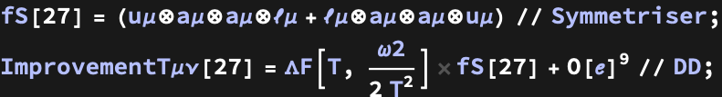

```wl
In[]:= XX = ImprovementT\[Mu]\[Nu][27] - T\[Mu]\[Nu]ConstructorEven[\[ScriptCapitalE]X[27], \[ScriptCapitalP]X[27], \[ScriptCapitalX]aaX[27], \[ScriptCapitalX]\[Omega]\[Omega]X[27], \[ScriptCapitalX]a\[Omega]X[27], \[ScriptCapitalQ]\[ScriptL]X[27]] + O[\[ScriptE]]^9 /. \[CapitalLambda] -> \[CapitalLambda]F // Simplify;
 % // MatrixForm
```

|  |  |  |  |
| - | - | - | - |
| -SeriesData- | -SeriesData- | -SeriesData- | -SeriesData- |
| -SeriesData- | -SeriesData- | -SeriesData- | -SeriesData- |
| -SeriesData- | -SeriesData- | -SeriesData- | -SeriesData- |
| -SeriesData- | -SeriesData- | -SeriesData- | -SeriesData- |

##### Term 29


```wl
In[]:= ImprovementT\[Mu]\[Nu][29] - T\[Mu]\[Nu]ConstructorEven[\[ScriptCapitalE]X[29], \[ScriptCapitalP]X[29], \[ScriptCapitalX]aaX[29], \[ScriptCapitalX]\[Omega]\[Omega]X[29], \[ScriptCapitalX]a\[Omega]X[29], \[ScriptCapitalQ]\[ScriptL]X[29]] + O[\[ScriptE]]^9 /. \[CapitalLambda] -> \[CapitalLambda]F // Simplify;
 % // MatrixForm
```

|  |  |  |  |
| - | - | - | - |
| -SeriesData- | -SeriesData- | -SeriesData- | -SeriesData- |
| -SeriesData- | -SeriesData- | -SeriesData- | -SeriesData- |
| -SeriesData- | -SeriesData- | -SeriesData- | -SeriesData- |
| -SeriesData- | -SeriesData- | -SeriesData- | -SeriesData- |

##### Term 31 (Scaled)

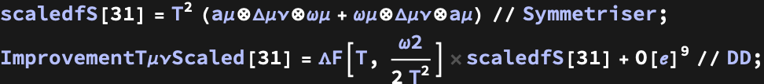

```wl
In[]:= ImprovementT\[Mu]\[Nu]Scaled[31] - T\[Mu]\[Nu]ConstructorEven[\[ScriptCapitalE]X[31] // scaleFunc, \[ScriptCapitalP]X[31] // scaleFunc, \[ScriptCapitalX]aaX[31] // scaleFunc, \[ScriptCapitalX]\[Omega]\[Omega]X[31] // scaleFunc, \[ScriptCapitalX]a\[Omega]X[31] // scaleFunc, \[ScriptCapitalQ]\[ScriptL]X[31] // scaleFunc] + O[\[ScriptE]]^9 /. \[CapitalLambda] -> \[CapitalLambda]F // Simplify // MatrixForm
```

|  |  |  |  |
| - | - | - | - |
| -SeriesData- | -SeriesData- | -SeriesData- | -SeriesData- |
| -SeriesData- | -SeriesData- | -SeriesData- | -SeriesData- |
| -SeriesData- | -SeriesData- | -SeriesData- | -SeriesData- |
| -SeriesData- | -SeriesData- | -SeriesData- | -SeriesData- |

### Belinfante tensor (odd levels)

##### Term 4

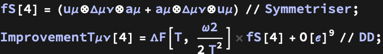

```wl
In[]:= ImprovementT\[Mu]\[Nu][4] - T\[Mu]\[Nu]ConstructorOdd[\[ScriptCapitalQ]aX[4], \[ScriptCapitalQ]\[Omega]X[4], \[ScriptCapitalX]a\[ScriptL]X[4], \[ScriptCapitalX]\[Omega]\[ScriptL]X[4]] + O[\[ScriptE]]^8 /. \[CapitalLambda] -> \[CapitalLambda]F // Simplify // MatrixForm
```

|  |  |  |  |
| - | - | - | - |
| -SeriesData- | -SeriesData- | -SeriesData- | -SeriesData- |
| -SeriesData- | -SeriesData- | -SeriesData- | -SeriesData- |
| -SeriesData- | -SeriesData- | -SeriesData- | -SeriesData- |
| -SeriesData- | -SeriesData- | -SeriesData- | -SeriesData- |

##### Term 17


```wl
In[]:= ImprovementT\[Mu]\[Nu][17] - T\[Mu]\[Nu]ConstructorOdd[\[ScriptCapitalQ]aX[17], \[ScriptCapitalQ]\[Omega]X[17], \[ScriptCapitalX]a\[ScriptL]X[17], \[ScriptCapitalX]\[Omega]\[ScriptL]X[17]] + O[\[ScriptE]]^10 /. \[CapitalLambda] -> \[CapitalLambda]F // Simplify // MatrixForm
```

|  |  |  |  |
| - | - | - | - |
| -SeriesData- | -SeriesData- | -SeriesData- | -SeriesData- |
| -SeriesData- | -SeriesData- | -SeriesData- | -SeriesData- |
| -SeriesData- | -SeriesData- | -SeriesData- | -SeriesData- |
| -SeriesData- | -SeriesData- | -SeriesData- | -SeriesData- |

##### Term 19


```wl
In[]:= ImprovementT\[Mu]\[Nu]Scaled[19] - T\[Mu]\[Nu]ConstructorOdd[\[ScriptCapitalQ]aX[19] // scaleFunc, \[ScriptCapitalQ]\[Omega]X[19] // scaleFunc, \[ScriptCapitalX]a\[ScriptL]X[19] // scaleFunc, \[ScriptCapitalX]\[Omega]\[ScriptL]X[19] // scaleFunc] + O[\[ScriptE]]^8 /. \[CapitalLambda] -> \[CapitalLambda]F // Simplify;
 % // MatrixForm
```

|  |  |  |  |
| - | - | - | - |
| -SeriesData- | -SeriesData- | -SeriesData- | -SeriesData- |
| -SeriesData- | -SeriesData- | -SeriesData- | -SeriesData- |
| -SeriesData- | -SeriesData- | -SeriesData- | -SeriesData- |
| -SeriesData- | -SeriesData- | -SeriesData- | -SeriesData- |

##### Term 21

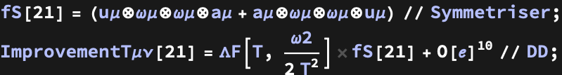

```wl
In[]:= ImprovementT\[Mu]\[Nu][21] - T\[Mu]\[Nu]ConstructorOdd[\[ScriptCapitalQ]aX[21], \[ScriptCapitalQ]\[Omega]X[21], \[ScriptCapitalX]a\[ScriptL]X[21], \[ScriptCapitalX]\[Omega]\[ScriptL]X[21]] + O[\[ScriptE]]^10 /. \[CapitalLambda] -> \[CapitalLambda]F // Simplify;
 % // MatrixForm
```

|  |  |  |  |
| - | - | - | - |
| -SeriesData- | -SeriesData- | -SeriesData- | -SeriesData- |
| -SeriesData- | -SeriesData- | -SeriesData- | -SeriesData- |
| -SeriesData- | -SeriesData- | -SeriesData- | -SeriesData- |
| -SeriesData- | -SeriesData- | -SeriesData- | -SeriesData- |

##### Term 23


```wl
In[]:= ImprovementT\[Mu]\[Nu][23] - T\[Mu]\[Nu]ConstructorOdd[\[ScriptCapitalQ]aX[23], \[ScriptCapitalQ]\[Omega]X[23], \[ScriptCapitalX]a\[ScriptL]X[23], \[ScriptCapitalX]\[Omega]\[ScriptL]X[23]] + O[\[ScriptE]]^10 /. \[CapitalLambda] -> \[CapitalLambda]F // Simplify;
 % // MatrixForm
```

|  |  |  |  |
| - | - | - | - |
| -SeriesData- | -SeriesData- | -SeriesData- | -SeriesData- |
| -SeriesData- | -SeriesData- | -SeriesData- | -SeriesData- |
| -SeriesData- | -SeriesData- | -SeriesData- | -SeriesData- |
| -SeriesData- | -SeriesData- | -SeriesData- | -SeriesData- |

##### Term 33


```wl
In[]:= ImprovementT\[Mu]\[Nu]Scaled[33] - T\[Mu]\[Nu]ConstructorOdd[\[ScriptCapitalQ]aX[33] // scaleFunc, \[ScriptCapitalQ]\[Omega]X[33] // scaleFunc, \[ScriptCapitalX]a\[ScriptL]X[33] // scaleFunc, \[ScriptCapitalX]\[Omega]\[ScriptL]X[33] // scaleFunc] + O[\[ScriptE]]^8 /. \[CapitalLambda] -> \[CapitalLambda]F // Simplify;
 % // MatrixForm
```

|  |  |  |  |
| - | - | - | - |
| -SeriesData- | -SeriesData- | -SeriesData- | -SeriesData- |
| -SeriesData- | -SeriesData- | -SeriesData- | -SeriesData- |
| -SeriesData- | -SeriesData- | -SeriesData- | -SeriesData- |
| -SeriesData- | -SeriesData- | -SeriesData- | -SeriesData- |

##### Term 34

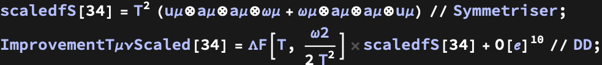

```wl
In[]:= ImprovementT\[Mu]\[Nu]Scaled[34] - T\[Mu]\[Nu]ConstructorOdd[\[ScriptCapitalQ]aX[34] // scaleFunc, \[ScriptCapitalQ]\[Omega]X[34] // scaleFunc, \[ScriptCapitalX]a\[ScriptL]X[34] // scaleFunc, \[ScriptCapitalX]\[Omega]\[ScriptL]X[34] // scaleFunc] + O[\[ScriptE]]^8 /. \[CapitalLambda] -> \[CapitalLambda]F // Simplify;
 % // MatrixForm
```

|  |  |  |  |
| - | - | - | - |
| -SeriesData- | -SeriesData- | -SeriesData- | -SeriesData- |
| -SeriesData- | -SeriesData- | -SeriesData- | -SeriesData- |
| -SeriesData- | -SeriesData- | -SeriesData- | -SeriesData- |
| -SeriesData- | -SeriesData- | -SeriesData- | -SeriesData- |

##### Term 36


```wl
In[]:= ImprovementT\[Mu]\[Nu]Scaled[36] - T\[Mu]\[Nu]ConstructorOdd[\[ScriptCapitalQ]aX[36] // scaleFunc, \[ScriptCapitalQ]\[Omega]X[36] // scaleFunc, \[ScriptCapitalX]a\[ScriptL]X[36] // scaleFunc, \[ScriptCapitalX]\[Omega]\[ScriptL]X[36] // scaleFunc] + O[\[ScriptE]]^8 /. \[CapitalLambda] -> \[CapitalLambda]F // Simplify;
 % // MatrixForm
```

|  |  |  |  |
| - | - | - | - |
| -SeriesData- | -SeriesData- | -SeriesData- | -SeriesData- |
| -SeriesData- | -SeriesData- | -SeriesData- | -SeriesData- |
| -SeriesData- | -SeriesData- | -SeriesData- | -SeriesData- |
| -SeriesData- | -SeriesData- | -SeriesData- | -SeriesData- |

## Thermodynamics

In this section we derive various core results of the paper concerning thermodynamic constraints and thermodynamic relations in conserved currents.

### Thermodynamic Constraints


```wl
In[]:= \[Delta]Consti = {\[Delta]\[ScriptCapitalE], \[Delta]\[ScriptCapitalP], \[Delta]\[ScriptCapitalX]aa, \[Delta]\[ScriptCapitalX]\[Omega]\[Omega], \[Delta]\[ScriptCapitalX]a\[Omega], \[Delta]\[ScriptCapitalQ]\[ScriptL], \[Delta]\[ScriptCapitalN], \[Delta]\[ScriptCapitalN]\[ScriptL]};
```

### Conservation Identities


```wl
Out[]= {0, 0}
```

```wl
In[]:= TraceIdentity[\[ScriptCapitalE]_, \[ScriptCapitalP]_, \[ScriptCapitalX]aa_, \[ScriptCapitalX]\[Omega]\[Omega]_, \[ScriptCapitalX]a\[Omega]_, \[ScriptCapitalQ]\[ScriptL]_, \[ScriptCapitalN]_, \[ScriptCapitalN]\[ScriptL]_] := -\[ScriptCapitalE] + 3 \[ScriptCapitalP] + \[ScriptCapitalX]aa T0^2 v\[Alpha]2 + \[ScriptCapitalX]\[Omega]\[Omega] T0^2 vw2 + 2 \[ScriptCapitalX]a\[Omega] T0^2 v\[Alpha]w
```


```wl
Out[]= {0, 0, 0}
```


```wl
Out[]= 0
```

```wl
Out[]= 0
```

### Redundancies in EoS

```wl
In[]:= EE = ThermoConstraints[\[Delta]\[ScriptCapitalE], \[Delta]\[ScriptCapitalP], \[Delta]\[ScriptCapitalX]aa, \[Delta]\[ScriptCapitalX]\[Omega]\[Omega], \[Delta]\[ScriptCapitalX]a\[Omega], \[Delta]\[ScriptCapitalQ]\[ScriptL], \[Delta]\[ScriptCapitalN], \[Delta]\[ScriptCapitalN]\[ScriptL]] + O[\[ScriptE]]^4;
```


```wl
In[]:= \[Delta]EOS = EOSConstructor4 @@ \[Delta]Consti // RedundantSolser // Simplify
```


### Entropy current redundancy


### Invariants


```wl
In[]:= \[ScriptCapitalI]2[\[Delta]EOS]
 \[ScriptCapitalI]4[\[Delta]EOS]
```

```wl
Out[]= 0
```

```wl
Out[]= 0
```

```wl
In[]:= \[Delta]\[ScriptCapitalF] = (\[Delta]\[ScriptCapitalP] + vw2 T0^2 \[Delta]\[ScriptCapitalX]\[Omega]\[Omega]) /. ScaleVars // # + O[\[ScriptE]]^7 & // Normal // Simplify;
```

```wl
In[]:= \[ScriptCapitalI]2[\[Delta]\[ScriptCapitalF]]
 \[ScriptCapitalI]4[\[Delta]\[ScriptCapitalF]]
```

```wl
Out[]= 0
```

```wl
Out[]= 0
```

### Fixing redundancy for conformal EoS


```wl
In[]:= \[Delta]C = \[Delta]\[ScriptCapitalF]Conf + O[\[ScriptE]]^11 // Simplify;
```


```wl
In[]:= \[Delta]C /. sol2 /. sol4 /. sol6 /. sol8 /. sol10 // Simplify
```


### Thermodynamic Relations


#### Generic Expressions


```wl
In[]:= \[ScriptCapitalF]C = \[ScriptCapitalP]C + vw2 T0^2 \[ScriptCapitalX]\[Omega]\[Omega]C;
```

```wl
In[]:= GeneralConsti = {\[ScriptCapitalE]C, \[ScriptCapitalP]C, \[ScriptCapitalX]aaC, \[ScriptCapitalX]\[Omega]\[Omega]C, \[ScriptCapitalX]a\[Omega]C, \[ScriptCapitalQ]\[ScriptL]C, \[ScriptCapitalN]C, \[ScriptCapitalN]\[ScriptL]C};
```

```wl
In[]:= \[ScriptCapitalI]2[\[ScriptCapitalP]C + vw2 T0^2 \[ScriptCapitalX]\[Omega]\[Omega]C]
 \[ScriptCapitalI]4[\[ScriptCapitalP]C + vw2 T0^2 \[ScriptCapitalX]\[Omega]\[Omega]C]
```


#### Imposing Conservation Identities


```wl
Out[]= {0, 0}
```

#### Deriving Thermodynamic Relations

```wl
In[]:= ThermoEEC = ThermoConstraints @@ (GeneralConsti + \[Delta]Consti) /. thermoC // # + O[\[ScriptE]]^4 &;
```


```wl
In[]:= ClearAll[ThermodynamicRelations]
```


```wl
In[]:= ThermodynamicRelationsAns - (ThermodynamicRelations @@ GeneralConsti) // FullSimplify
```

```wl
Out[]= {0, 0, 0, 0, 0}
```

## Massless Dirac Fermions

### Expressions


```wl
In[]:= FermionConsti = {\[ScriptCapitalE]Fermion, \[ScriptCapitalP]Fermion, \[ScriptCapitalX]aaFermion, \[ScriptCapitalX]\[Omega]\[Omega]Fermion, \[ScriptCapitalX]a\[Omega]Fermion, \[ScriptCapitalQ]\[ScriptL]Fermion, \[ScriptCapitalN]Fermion, \[ScriptCapitalN]\[ScriptL]Fermion};
```

```wl
In[]:= ConservationIdentity @@ FermionConsti // Simplify
 TraceIdentity @@ FermionConsti // Simplify
```

```wl
Out[]= {0, 0}
```

```wl
Out[]= 0
```

```wl
In[]:= ThermodynamicRelations @@ FermionConsti // Simplify
```

```wl
Out[]= {0, 0, 0, 0, 0}
```

### Equation of state

```wl
In[]:= ThermoEEFermion = ThermoConstraints @@ (FermionConsti + \[Delta]Consti) // # + O[\[ScriptE]]^4 &;
```


```wl
In[]:= EOSFermion = EOSConstructor4 @@ (FermionConsti + \[Delta]Consti) // FermionSolser // # + O[\[ScriptE]]^5 &
```


```wl
In[]:= \[ScriptCapitalI]2[EOSFermion]
 \[ScriptCapitalI]4[EOSFermion]
```


## Massive Dirac Fermions

### Expressions


```wl
In[]:= MFermionConsti = {\[ScriptCapitalE]MFermion, \[ScriptCapitalP]MFermion, \[ScriptCapitalX]aaMFermion, \[ScriptCapitalX]\[Omega]\[Omega]MFermion, \[ScriptCapitalX]a\[Omega]MFermion, \[ScriptCapitalQ]\[ScriptL]MFermion, \[ScriptCapitalN]MFermion, \[ScriptCapitalN]\[ScriptL]MFermion};
```

```wl
In[]:= ConservationIdentity @@ MFermionConsti // FullSimplify
 TraceIdentity @@ MFermionConsti // FullSimplify
```

```wl
Out[]= {0, 0}
```


```wl
In[]:= ThermodynamicRelations @@ MFermionConsti // FullSimplify
```

```wl
Out[]= {0, 0, 0, 0, 0}
```

### Limit check (no need to evaluate)

```wl
In[]:= MasslessExpand[F_] := Sum[(-1)^(n + 1) F + O[m] // # + O[\[Nu]]^10 & // Normal, {n, 1, \[Infinity]}, Regularization -> "Dirichlet"]
```

```wl
In[]:= MasslessExpand[\[ScriptCapitalE]MFermion] - \[ScriptCapitalE]Fermion /. ScaleVars // # + O[\[ScriptE]]^4 & // Expand // Simplify
 MasslessExpand[\[ScriptCapitalP]MFermion] - \[ScriptCapitalP]Fermion /. ScaleVars // # + O[\[ScriptE]]^4 & // Expand // Simplify
 MasslessExpand[\[ScriptCapitalX]aaMFermion] - \[ScriptCapitalX]aaFermion /. ScaleVars // # + O[\[ScriptE]]^2 & // Expand // Simplify
 MasslessExpand[\[ScriptCapitalX]\[Omega]\[Omega]MFermion] - \[ScriptCapitalX]\[Omega]\[Omega]Fermion /. ScaleVars // # + O[\[ScriptE]]^2 & // Expand // Simplify
 MasslessExpand[\[ScriptCapitalX]a\[Omega]MFermion] - \[ScriptCapitalX]a\[Omega]Fermion /. ScaleVars // # + O[\[ScriptE]]^2 & // Expand // Simplify
 MasslessExpand[\[ScriptCapitalQ]\[ScriptL]MFermion] - \[ScriptCapitalQ]\[ScriptL]Fermion /. ScaleVars // # + O[\[ScriptE]]^2 & // Expand // Simplify
 MasslessExpand[\[ScriptCapitalN]MFermion] - \[ScriptCapitalN]Fermion /. ScaleVars // # + O[\[ScriptE]]^4 & // Expand // Simplify
 MasslessExpand[\[ScriptCapitalJ]\[ScriptL]MFermion] - \[ScriptCapitalJ]\[ScriptL]Fermion /. ScaleVars // # + O[\[ScriptE]]^2 & // Expand // Simplify
```


### Equation of state

```wl
In[]:= ThermoEEMFermion = ThermoConstraints @@ (MFermionConsti + \[Delta]Consti) // # + O[\[ScriptE]]^2 &;
```


|  |  |  |  |  |
| - | - | - | - | - |
| -SeriesData- | -SeriesData- | -SeriesData- | -SeriesData- | -SeriesData- |

```wl
In[]:= EOSMFermion = EOSConstructor2 @@ (MFermionConsti + \[Delta]Consti) // MFermionSolser // FullSimplify
```


```wl
In[]:= I2Fermion = EOSMFermion // \[ScriptCapitalI]2 // FullSimplify
```


## Massless Scalar Fields

### Expressions


```wl
In[]:= ScalarConsti = {\[ScriptCapitalE]Scalar, \[ScriptCapitalP]Scalar, \[ScriptCapitalX]aaScalar, \[ScriptCapitalX]\[Omega]\[Omega]Scalar, \[ScriptCapitalX]a\[Omega]Scalar, \[ScriptCapitalQ]\[ScriptL]Scalar, \[ScriptCapitalN]Scalar, \[ScriptCapitalN]\[ScriptL]Scalar};
```

```wl
In[]:= ConservationIdentity @@ ScalarConsti // Simplify
 TraceIdentity @@ ScalarConsti // FullSimplify
```

```wl
Out[]= {0, 0}
```


```wl
In[]:= ThermodynamicRelations @@ ScalarConsti
```

```wl
Out[]= {0, 0, 0, 0, 0}
```

### Equation of state

```wl
In[]:= ThermoEEScalar = ThermoConstraints @@ (ScalarConsti + \[Delta]Consti) // # + O[\[ScriptE]]^4 &;
```


```wl
In[]:= EOSScalar = EOSConstructor4 @@ (ScalarConsti + \[Delta]Consti) // ScalarSolser // # + O[\[ScriptE]]^5 &
```


```wl
In[]:= \[ScriptCapitalI]2[EOSScalar]
 \[ScriptCapitalI]4[EOSScalar]
```


## Massive Scalar Fields

### Scalar Expressions


```wl
In[]:= MScalarConsti = {\[ScriptCapitalE]MScalar, \[ScriptCapitalP]MScalar, \[ScriptCapitalX]aaMScalar, \[ScriptCapitalX]\[Omega]\[Omega]MScalar, \[ScriptCapitalX]a\[Omega]MScalar, \[ScriptCapitalQ]\[ScriptL]MScalar, \[ScriptCapitalN]MScalar, \[ScriptCapitalN]\[ScriptL]MScalar};
```

```wl
In[]:= ConservationIdentity @@ MScalarConsti // FullSimplify
 TraceIdentity @@ MScalarConsti // FullSimplify
```

```wl
Out[]= {0, 0}
```


```wl
In[]:= ThermodynamicRelations @@ MScalarConsti // FullSimplify
```

```wl
Out[]= {0, 0, 0, 0, 0}
```

### Limit check (no need to evaluate)

```wl
In[]:= MasslessExpandBoson[F_] := Sum[F + O[m] // # + O[\[Nu]]^10 & // Normal, {n, 1, \[Infinity]}, Regularization -> "Dirichlet"]
```

```wl
In[]:= MasslessExpandBoson[\[ScriptCapitalE]MScalar] - \[ScriptCapitalE]Scalar + O[\[ScriptE]]^4 /. ScaleVars // Expand // FullSimplify
 MasslessExpandBoson[\[ScriptCapitalP]MScalar] - \[ScriptCapitalP]Scalar + O[\[ScriptE]]^4 /. ScaleVars // Expand // FullSimplify
 MasslessExpandBoson[\[ScriptCapitalX]aaMScalar] - \[ScriptCapitalX]aaScalar /. ScaleVars // # + O[\[ScriptE]]^2 & // Expand // Simplify
 MasslessExpandBoson[\[ScriptCapitalX]\[Omega]\[Omega]MScalar] - \[ScriptCapitalX]\[Omega]\[Omega]Scalar /. ScaleVars // # + O[\[ScriptE]]^2 & // Expand // Simplify
 MasslessExpandBoson[\[ScriptCapitalX]a\[Omega]MScalar] - \[ScriptCapitalX]a\[Omega]Scalar /. ScaleVars // # + O[\[ScriptE]]^2 & // Expand // Simplify
 MasslessExpandBoson[\[ScriptCapitalQ]\[ScriptL]MScalar] - \[ScriptCapitalQ]\[ScriptL]Scalar /. ScaleVars // # + O[\[ScriptE]]^2 & // Expand // Simplify
 MasslessExpandBoson[\[ScriptCapitalN]MScalar] - \[ScriptCapitalN]Scalar /. ScaleVars // # + O[\[ScriptE]]^6 & // Expand // Simplify
 MasslessExpandBoson[\[ScriptCapitalN]\[ScriptL]MScalar] - \[ScriptCapitalN]\[ScriptL]Scalar /. ScaleVars // # + O[\[ScriptE]]^6 & // Expand // Simplify
```


```wl
Out[]= 0
```


### Equation of state

```wl
In[]:= ThermoEEMScalar = ThermoConstraints @@ (MScalarConsti + \[Delta]Consti) // # + O[\[ScriptE]]^2 &;
```


|  |  |  |  |  |
| - | - | - | - | - |
| -SeriesData- | -SeriesData- | -SeriesData- | -SeriesData- | -SeriesData- |

```wl
In[]:= EOSMScalarVal = EOSConstructor2 @@ (MScalarConsti + \[Delta]Consti) // MScalarSolser // # + O[\[ScriptE]]^3 & // FullSimplify
```


```wl
In[]:= \[ScriptCapitalI]2[EOSMScalar] /. \[ScriptE] -> 1 // FullSimplify
```


## Export

```wl
In[]:= Export["notebook.md", EvaluationNotebook[]]
```